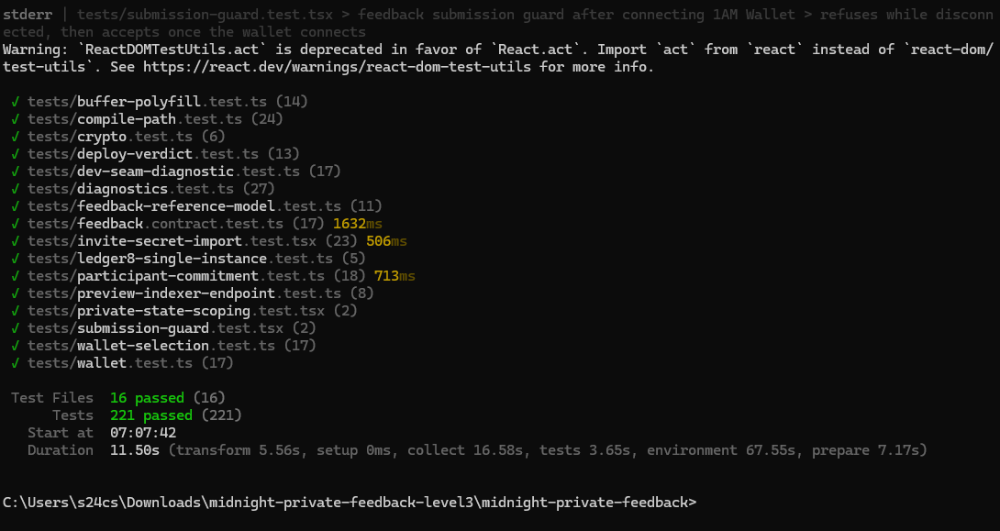
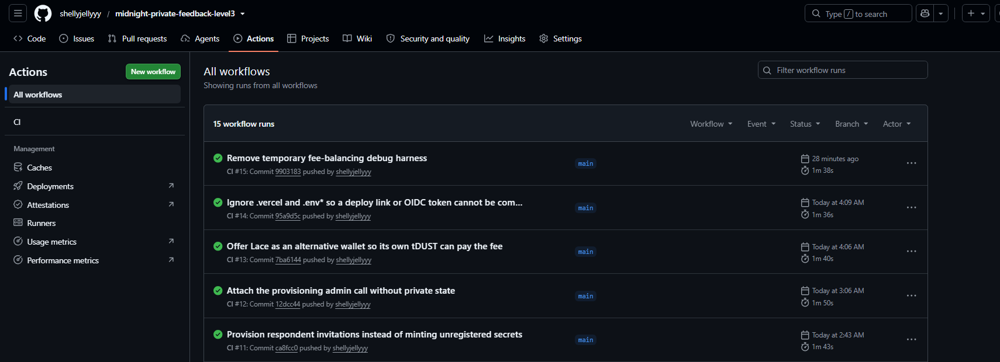

# Midnight Private Feedback

[](https://github.com/shellyjellyyy/midnight-private-feedback-level3/actions/workflows/ci.yml)

> A privacy-preserving feedback/survey dApp built with Midnight, allowing respondents to prove participation and submit feedback without revealing their identity or private comment on-chain.

## Live Demo

**https://midnight-private-feedback-level3-khaki.vercel.app/**

This is the deployed, live dApp. It runs against the real deployed contract on Midnight Preview (retained ledger-v8). Connect a Midnight wallet, import an organiser-issued invitation, and submit feedback — proof generation happens entirely in the browser.

## Contract Address

**Network:** Midnight Preview — retained ledger-v8 deployment

**Contract:**

```
916ae63acf5d4256a33c249cf138938cb9cb33210cf6081feecb2a18648248bc
```

The contract is compiled from `contracts/feedback.compact` with Compact `0.31.1` and targets the retained ledger-v8 toolchain, which is what Midnight Preview currently runs.

## What This Does

This is an anonymous feedback / survey dApp. A respondent who has been issued an invitation can submit a rating and an optional free-text comment **without the survey being able to link that submission to the respondent**.

- **Eligibility is proven, not asserted.** The respondent holds a 32-byte invitation secret. The circuit proves that the hash of that secret is a leaf in the organiser-controlled Merkle tree published on-chain. The secret and the Merkle path are *private witnesses* — they are consumed by the proving system and never written to the ledger.
- **The comment stays private.** The comment is stored only as a SHA-256 commitment. The plaintext is hashed locally in the browser and discarded; it never leaves the device in plaintext.
- **The rating is deliberately disclosed.** The rating itself is `disclose`d by the circuit, because the on-chain tally is public by design. An observer can infer the submitted rating from the transaction. This is intentional, and it is why the *tally* is public while the *identity* is not.
- **The public tally updates on-chain.** `rating1`..`rating5` counters are incremented, along with `responseCount`.
- **A respondent cannot submit twice.** A domain-separated nullifier — scoped to this specific contract address — is computed from the secret and inserted into `usedNullifiers`. The circuit asserts it has not been spent, so the same invitation is strictly single-use per survey deployment.

## Privacy Model

### Public / Observable

An observer reading the Preview ledger can learn:

- the deployed contract address, and that the contract exists;
- the full public ledger state: `participantCount`, `responseCount`, `rating1`..`rating5`, `surveyOpen`, `adminAddress`;
- the public `participants` Merkle tree and the `commentCommitments` map — **commitments only**, never preimages;
- the set of spent nullifiers in `usedNullifiers`;
- that a transaction occurred, its block, its transaction id, and its fee;
- **the rating submitted by that transaction** (disclosed by the circuit, required by the public tally);
- that the submitter holds a valid, previously-unused invitation (this is what the proof attests to).

### Private

The following never appear on-chain in any form:

- the respondent's invitation secret, or any preimage of it;
- the Merkle path proving membership;
- the private comment plaintext;
- any direct identifier of the respondent.

The respondent's invitation secret is held **locally**, in the browser's private state during the session. It is never transmitted, never logged, and never persisted server-side.

### What Is Proven Without Revealing It

The `submitFeedback` circuit proves, in zero-knowledge:

1. **Membership** — the caller knows a secret whose commitment is a leaf of the on-chain `participants` tree (Merkle path verified against the published root).
2. **Path binding** — the supplied path belongs to *that specific* commitment, not merely to some leaf in the tree.
3. **Single use** — the contract-scoped nullifier for that secret has not been spent.
4. **Valid input** — the rating is bound-checked to `1..=5` before it is allowed to influence public state.

All four hold *without* the prover disclosing the secret, the path, or the comment.

## Privacy Claim

> An on-chain observer can see the public survey state and the disclosed rating/tally information, but cannot derive the respondent's private identity, invitation secret, or private comment from the contract state.

This is deliberately weaker than "completely anonymous". The rating **is** disclosed per transaction, the tally is public, and transaction metadata is public. What is protected is the link between a submission and a person.

## Tech Stack

- **Midnight Compact** — privacy-preserving smart contract language (`contracts/feedback.compact`)
- **Compact compiler** — `0.31.1` (retained v8 era), with `0.34.0` for the forward-looking v9 artifact
- **Midnight.js SDK** — `midnight-js-protocol`, `-contracts`, `-types`, `-network-id`, `-utils` at `5.0.0-beta.8`
- **Proof providers** — `midnight-js-fetch-zk-config-provider`, `-http-client-proof-provider`, `-dapp-connector-proof-provider`, `-indexer-public-data-provider`
- **Private state** — `midnight-js-level-private-state-provider` (IndexedDB)
- **Wallet** — `@midnight-ntwrk/dapp-connector-api` `^4.0.1`; **Lace wallet** via DApp Connector
- **Retained runtime** — `@midnight-ntwrk/compact-runtime` `0.16.0` (npm-aliased as `compact-runtime-ledger8`) and `@midnight-ntwrk/onchain-runtime-v3`
- **React** `^18.3.1` + **TypeScript** `^5.5.4` + **Vite** `^5.4.21`
- **Vitest** — test runner (`jsdom`)
- **GitHub Actions** — CI
- **Vercel** — hosting

## Prerequisites

- **Node.js 22** (matches CI)
- **npm**
- A **Midnight-compatible wallet** (Lace) for submitting feedback
- An **organiser-issued invitation secret** — participation requires a secret whose commitment the organiser has registered on-chain

On Windows the Compact compiler runs inside **WSL**, so WSL must be available to recompile the contract. You do **not** need WSL to run or build the dApp.

## Setup & Run Locally

```bash
git clone https://github.com/shellyjellyyy/midnight-private-feedback-level3.git
cd midnight-private-feedback-level3
npm install
```

**Contract compilation** (only needed if you change `contracts/feedback.compact`; the generated artifacts are committed):

```bash
npm run compile:v8   # retained Preview artifact -> managed/feedback-v8
npm run compile:v9   # forward-looking v9 artifact -> managed/feedback
```

**Development server** — the live Preview/ledger-v8 experience:

```bash
npm run build:preview   # one-time: builds with VITE_MIDNIGHT_ERA=v8-preview
npx vite --mode preview-era
```

**Other commands:**

```bash
npm run build      # build (current era)
npm run preview    # serve the production build locally
npm run patch      # apply required runtime patches (see below)
```

### Runtime patches (required)

The DUST fee-balancing segment must never be emitted empty, or the ledger rejects the
transaction as non-canonical. `npm run patch` applies a local, version-checked,
idempotent, byte-exactly reversible fix. `npm run check:offline` verifies it.

### Environment

Copy `.env.example` to `.env.local`. The deployed contract address is the default:

```
VITE_CONTRACT_ADDRESS=916ae63acf5d4256a33c249cf138938cb9cb33210cf6081feecb2a18648248bc
```

## Run Tests

```bash
npm test
```

Verified current result — **221 tests passing across 16 test files**.

The suite is fully offline and deterministic: it requires no wallet, no seed, no
funded account, no proof server and no RPC endpoint.



*221 automated tests passing across 16 test files.*

## CI/CD

GitHub Actions runs on **every push and every pull request** via
[`.github/workflows/ci.yml`](.github/workflows/ci.yml).

The workflow performs a lockfile-exact install, re-applies and re-verifies the
runtime patches, type-checks, builds, and runs the full test suite. It is
deterministic and offline with respect to Midnight, and it **never broadcasts a
transaction or deploys a contract**. On-chain verification is deliberately not a CI
gate, since it queries live Preview.



*GitHub Actions CI workflow passing on main.*

## Submission Evidence

### Test Output


*221 automated tests passing across 16 test files.*

### CI/CD


*GitHub Actions CI workflow passing on main.*

### Live dApp

<!-- TODO: Add docs/screenshots/dapp-success.png after capturing the successful live dApp submission -->

## Demo Video

<!-- TODO: Replace this placeholder with the final 1-minute demo video URL -->

[VIDEO DEMO — TO BE ADDED]

The video should show wallet connection, the full feedback flow, circuit/proof
execution, the successful result, and the privacy behaviour.

## Product Proposal

See **[PROPOSAL.md](PROPOSAL.md)** — this project corresponds to the
**Anonymous Feedback / Survey** idea: verifiable participation with private
responses. It is included here for submission.

## Repository Layout

```
contracts/feedback.compact     the Compact contract source
managed/feedback-v8/           generated retained ledger-v8 artifact (committed)
managed/feedback/              generated v9 artifact (committed)
src/                           dApp source (React + Midnight.js)
scripts/                       compile / deploy / verify / provisioning tooling
tests/                         Vitest suites
docs/                          deployment, usage and demo documentation
.github/workflows/ci.yml       CI
```